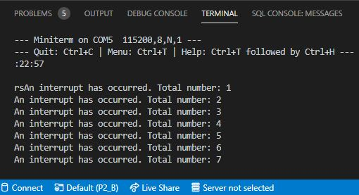

# PRACTICA 2B  :  Interrupción Por Timer

## 1.Código

'#'include<Arduino.h>

volatile int interruptCounter;
int totalInterruptCounter;
hw_timer_t * timer = NULL;
portMUX_TYPE timerMux = portMUX_INITIALIZER_UNLOCKED;

void IRAM_ATTR onTimer() {

    portENTER_CRITICAL_ISR(&timerMux);
    interruptCounter++;
    portEXIT_CRITICAL_ISR(&timerMux);

}

void setup() {

    Serial.begin(115200);
    timer = timerBegin(0, 80, true);
    timerAttachInterrupt(timer, &onTimer, true);
    timerAlarmWrite(timer, 1000000, true);
    timerAlarmEnable(timer);

}

void loop() {

    if (interruptCounter > 0) {

        portENTER_CRITICAL(&timerMux);
        interruptCounter--;
        portEXIT_CRITICAL(&timerMux);
        totalInterruptCounter++;
        Serial.print("An interrupt has occurred. Total number: ");
        Serial.println(totalInterruptCounter);

    }
    
}

## 2.Funcionamiento

Para comenzar, configuramos el setup abriendo la conexión serie "Serial.begin(115200)" para generar los resultados por el monitor. Entonces, inicializamos un temporizador mediante la instrucción "timer = timerBegin(0, 80, true)". Antes de habilitarlo, lo vinculamos a una función que se ejecutará cuando se genere la interrupción ("timerAttachInterrupt(timer, &onTimer, true)"). A continuación, usamos la función "timerAlarmWrite(timer, 1000000, true)" para especificar el valor del contador en el que se generará la interrupción del temporizador. Finalmente, lo habilitamos con la función "timerAlarmEnable(timer)".

En cuanto al loop, en cada bucle compararemos si la variable "interruptCounter" es mayor que 0 y, si lo es, decrementaremos este contador, señalando que la interrupción ha sido reconocida y será utilizada. 
Así pues, el uso de las interrupciones consistirá en incrementar el contador con el número total de interrupciones ocurridas desde el inicio del programa e imprimirlo por el terminal.

## 3.Salida Del Terminal

